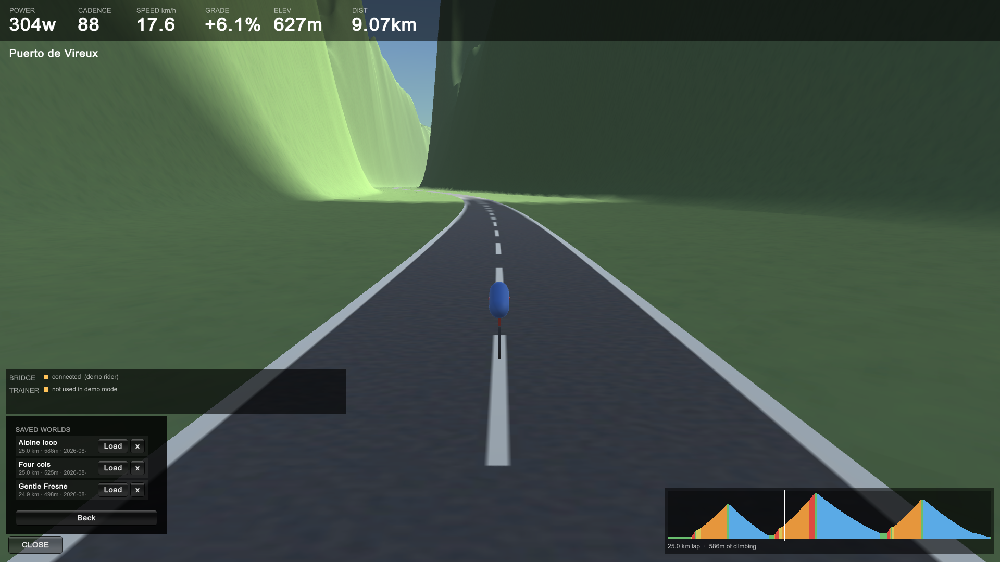
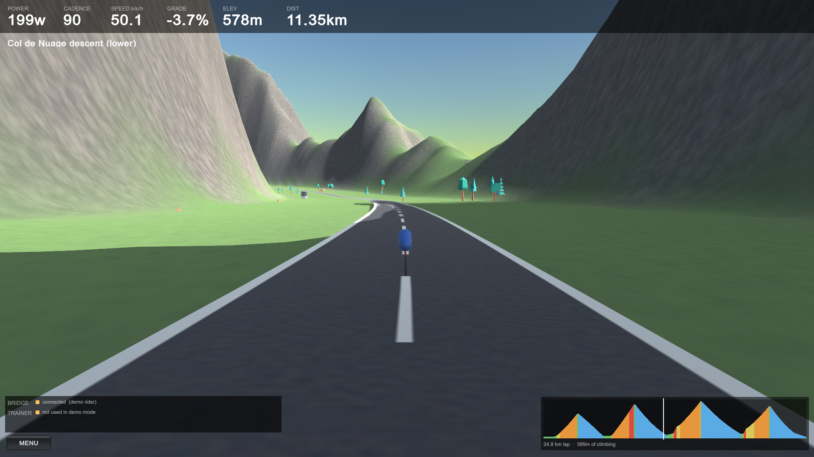
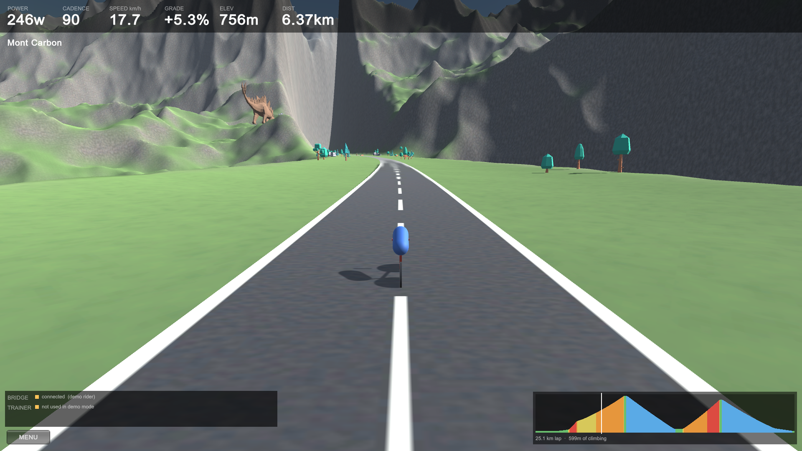
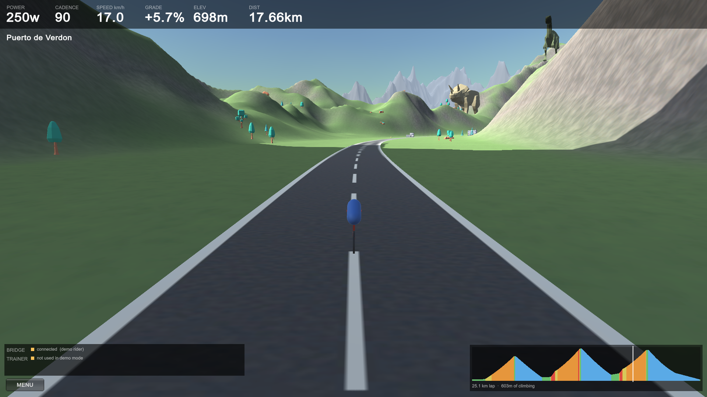

# VibeRide — details

Everything beyond the basics. See the [README](README.md) for what this is and
how to get it.

## Contents

- [Architecture](#architecture) — why the bridge is a separate process
- [Scenery](#scenery) — seed-driven prop placement
- [The hilltop monument](#the-hilltop-monument) — finding a summit worth putting it on
- [Lakes and boats](#lakes-and-boats) — carved basins, and why they are hard to see
- [The falling side](#the-falling-side) — why the road corridor is no longer symmetric
- [In-app menu](#in-app-menu) — units, regenerate, save/load
- [The world](#the-world) — course generation and its constraints
- [Running on macOS](#running-on-macos) — building, packaging, releasing
- [Gotchas worth remembering](#gotchas-worth-remembering)

## Architecture

Two processes, deliberately:

```
   KICKR  ──BLE/FTMS──▶  bridge (Python)  ──WebSocket JSON──▶  Unity 6
          ◀──grade────                    ◀──terrain grade───
```

The BLE connection lives in Python, **not** in Unity. Unity has no built-in
Bluetooth, and desktop BLE plugins covering both Windows and macOS are scarce,
paid, and fragile. `bleak` speaks WinRT on Windows and CoreBluetooth on macOS
from the same source, so the Mac port is a non-event.

The bridge also owns the physics. Unity's only jobs are to render, to sample the
terrain slope under the bike, and to send that slope back. The loop closes when
the bridge forwards the grade to the trainer as FTMS simulation parameters —
which is what makes the flywheel physically harder on a climb.

### The app launches the bridge

`BridgeLauncher` starts the bridge as a child process at startup, so opening the
app is all you have to do. If a bridge is already listening it defers to that one
instead, which keeps a hand-started debugging session from being fought over.

Shutdown is layered, because an orphaned bridge keeps the trainer's single BLE
connection and blocks the next launch:

| Mechanism | Covers | Measured |
| --- | --- | --- |
| `shutdown` on child stdin | normal quit | 0.01 s |
| stdin EOF | app died without a word | 0.02 s |
| `--parent-pid` watchdog | hard crash / force-quit | 1.66 s |
| `Process.Kill()` | anything still hanging on | last resort |

`bridge/test_shutdown.py` exercises the first three plus the port-conflict path.
An end-to-end check — launch the built player, confirm the child appears, kill
the player outright, confirm nothing is left behind — is the one that actually
proves it.

## Layout

| Path | What it is |
| --- | --- |
| `bridge/kickr_bridge/ftms.py` | FTMS wire format — pure functions over bytes |
| `bridge/kickr_bridge/physics.py` | Power → speed model (gravity, rolling, aero) |
| `bridge/kickr_bridge/trainer.py` | BLE connection + control point serialisation |
| `bridge/kickr_bridge/server.py` | WebSocket server tying it together |
| `bridge/scan.py` | BLE discovery / GATT dump |
| `bridge/selftest.py` | Offline checks — no hardware needed |
| `bridge/testclient.py` | Fake Unity client for exercising the bridge |

## Running

Scan for the trainer (spin the cranks first — it sleeps):

```bash
cd bridge && .venv/Scripts/python.exe scan.py --connect KICKR
```

Start the bridge:

```bash
cd bridge && .venv/Scripts/python.exe -m kickr_bridge.server
```

Work on the 3D side with no trainer present:

```bash
cd bridge && .venv/Scripts/python.exe -m kickr_bridge.server --demo
```

## Scenery

`PropScatter` places trees, boulders, farmhouses, parked vehicles and dinosaurs
across the landscape, **deterministically from the world seed**. That matters
because a saved world persists nothing but its seed — if placement were not
reproducible, loading a favourite would give you a different landscape than the
one you saved. The scatter draws from its own random stream, salted off the seed,
so adding a new prop kind cannot shift the terrain of an already-saved world.

Run the player with `-verifyscatter` to scatter twice and compare fingerprints,
and `-startnear dinosaur` to jump to a placed instance rather than hunting for
one at roughly one per kilometre.

> **Placement is stable for a given seed and a given build, not across builds.**
> Anything that changes how many random numbers the scatter draws will shift
> every position downstream of it — adding the dinosaur material picker moved the
> whole layout, because choosing a material consumes a draw. Terrain and course
> are unaffected, since the scatter uses its own salted stream, so a saved world
> keeps its mountains and its climbs; only where the trees stand can move.

Each kind carries its own placement rules, which is what stops everything landing
in one uniform sprinkle:

| Kind | Per km | Offset from road | Max slope | Notes |
| --- | --- | --- | --- | --- |
| conifer | 58 | 16–150 m | 34° | clusters of 2–6 |
| boulder | 24 | 13–140 m | 40° | tilts with the ground, 30% buried |
| farmhouse | 4 | 40–130 m | 15° | clusters of 1–4 |
| parked vehicle | 2.5 | 11–17 m | 12° | hugs the verge |
| dinosaur | 1.1 | 45–150 m | 24° | rare |

Models live in `unity/Assets/Models/`, all **CC0** — Kenney's Nature, Car and City
kits, plus Quaternius's Animated Dinosaur Pack. Sources and licences are recorded
in [`Models/CREDITS.md`](unity/Assets/Models/CREDITS.md). Each kind holds several
variants and picks one per instance, so a copse is not the same tree stamped nine
times. Any kind with no models assigned falls back to a coloured primitive, so a
partial import degrades instead of breaking the build.

Models are **not** scaled at import. Each is normalised by its measured bounds to
the kind's `TargetHeight` in metres, because an imported model arrives in whatever
units its author chose. The scale factor is clamped: normalising on height alone
blows up anything wide and flat, and a tree stump forced to 2.2 m tall became an
8 m slab lying in the grass.

Three things that were wrong on the first attempt, all worth not re-introducing:

- **A single global instance budget spent in list order starves whatever comes
  last.** Trees are first and clustered, so they ate the entire allowance and no
  dinosaur was ever placed. Budgets are now allotted per kind and scaled down
  together when the total exceeds the cap.
- **Rejected placements need retrying.** Slope tests reject most candidates on
  mountainous ground, and without retries farmhouses filled 6 of 76 slots.
- **Primitives pivot at their centre**, so placing one at ground height buries
  half of it. Instances are lifted by their scaled half-height, less whatever
  `GroundSink` the kind asks for — rocks look wrong perched on the surface, trees
  look wrong sunk into it.

## Aircraft flyby

Every 50-160 seconds an aircraft crosses the sky ahead of the rider, trailing a
contrail.

Unlike scenery, this is **deliberately not seeded**. Placement has to be
reproducible because a saved world stores only its seed, but a flyby is an event
in time rather than a feature of the landscape -- the same plane appearing at the
same second of every ride would read as a loop, not as weather.

Getting it visible took measuring rather than guessing. The first three attempts
put a plane on screen that nobody could see:

| Attempt | What happened |
| --- | --- |
| Triggered at startup | Fired before the camera was positioned, a kilometre behind |
| Crossing 250-700 m ahead at up to 340 m | ~26 degrees elevation, at the frame edge or behind the stat bar |
| 14 m wingspan at ~900 m | Subtends 0.8 degrees -- about **14 pixels**, a speck against green mountains |

Running the player with `-flyby` logs the aircraft's viewport coordinates each
second, which is what finally showed it had been on screen the whole time and
simply too small to notice. It now crosses 500-950 m ahead at 90-190 m with a
26 m wingspan, roughly 30-50 px, and the contrail does most of the work of
drawing the eye.

`-flybyapproach <metres>` shortens the run-in so a screenshot can catch it near
the crossing point instead of waiting out a 1.4 km approach.

The aeroplane is built from primitives. `PlanePrefab` takes a real model instead,
normalised by measured bounds to `TargetWingspan` the same way scenery is.

## The hilltop monument

One cyclist monument stands on a summit overlooking every course, arms up in a
finish-line salute -- the kind of thing real mountains collect, like Simpson on
the Ventoux or Pantani at the Mortirolo.

It is not scenery. `PropScatter` throws hundreds of objects near the road at
random offsets, which is right for trees and wrong for a landmark: a landmark has
to be the same rock every lap, visible from a long way out, somewhere that looks
chosen. `HilltopStatue` therefore searches the generated terrain instead of
sampling it.

### Finding the summit

Seed points are thrown out sideways from the road at 320-1500 m, then
**hill-climbed** -- walk to the highest of eight neighbours, coarse steps first
(90 m, then 45 m, then 22 m) so shallow ground is crossed quickly and the top is
settled on precisely. Many seeds converge on the same hill, so results are
rounded onto a 150 m grid and de-duplicated. About 960 seeds yield 20-40 distinct
summits.

Seeding from the route rather than sweeping the whole 10 km map is both cheaper
and better targeted: a spectacular peak in the far corner of the terrain is not a
landmark for this ride, because you never see it.

Each surviving summit is then measured:

| Measure | Why |
| --- | --- |
| Prominence | Height above the **mean** of a ring at 260 m. The mean is what separates a peak from a point partway up a slope -- max or min would not |
| Rise above the road | It has to be above you to be a hilltop |
| Visible viewpoints | Sweeping the approach at 50 m intervals, counting those with clear line of sight, within 34 degrees of straight ahead and under 11 degrees up |

The visibility sweep is the part that matters, and it is the whole reason the
component measures rather than assumes. The closest qualifying viewpoint becomes
`BestViewDistance`, which `-startnearstatue` uses directly.

### Four ways to place a statue nobody can see

| Attempt | What happened |
| --- | --- |
| Score by raw prominence | Elected the biggest mountain on the map: 1128 m above the road, 1160 m away, **44 degrees up** -- magnificent, permanently off the top of the frame |
| Line of sight from the nearest road point | The nearest point is 90 degrees off the direction you look. Cleared it there and put the monument squarely behind a nearer ridge |
| Framing computed separately in the capture code | Two places deciding what "visible" means, only one checking line of sight |
| Elevation capped at 24 degrees by FOV arithmetic | Ignored that the chase camera looks ~9 degrees **down** and the stat bar covers the top 78 px. Base landed at viewport y 0.94 -- on screen by the maths, behind the HUD in fact |

Prominence now saturates at 110 m: past that a summit already reads as a mountain
top and extra height is a liability, because at a fixed elevation angle the
viewing distance scales with the rise. A hill twice as high is seen from twice as
far and looks no bigger -- it just gets harder to fit in frame.

### The sculpture

Built from primitives, normalised by measured bounds to `TotalHeight` (50 m), the
same way the aircraft and the scenery are. `StatuePrefab` takes a real model
instead.

Three things had to be measured rather than eyeballed:

- **Thickness.** A 30 mm bicycle tube scaled to 50 m is under half a metre and
  renders as nothing. Everything is at monument gauge, not bicycle gauge.
- **Angle.** The two halves want opposite views. A bike is legible side-on and
  vanishes head-on; the raised arms spread *across* the bike's axis and so vanish
  exactly when the bike looks best. Dead broadside produced a perfect bicycle
  under a figure that read as a stick. It now stands at 58 degrees to the
  viewpoint -- the bike keeps 85% of its length, the arms open to 53% -- and the
  hands are carried forward of the shoulders so the salute has a diagonal to
  trace from the side.
- **Plinth height.** Kept under a third of the total. Whatever goes into the base
  is height not spent on the part that has to be recognisable from half a
  kilometre away.

A buried footing is added *after* normalisation, deep enough to reach the lowest
ground the base overhangs, so it cannot contribute to the measured height. On the
downhill side it shows as a retaining wall, which is what a real hilltop terrace
looks like. Dropping the whole plinth to that lowest point instead -- the first
attempt -- sank it by however much a steep summit falls away, which was most of
the plinth, with the peak poking up in front of it.

### Checking it

`-statueportrait` parks the camera beside the monument (`-portraitrange`,
`-portraitangle`). Judging a model from a 70 px smudge on a hillside is
guesswork; this separates "is the sculpture any good" from "is it placed and
framed well", which are two different bugs with two different fixes.

`-startnearstatue` jumps the rider to `BestViewDistance` and logs the monument's
viewport position, apparent pixel height, and whether its head clears the stat
bar. Capture modes also set `BikeRider.Frozen`, because otherwise the rider
freewheels downhill while the camera settles -- measured at 90 m over a five
second delay, enough to swing the subject from mid-frame to behind the HUD.

The search costs about 190 ms, once, inside the regenerate that already takes
around six seconds. Placement is fully seed-determined, which it has to be: a
saved world stores only its seed.

## Lakes and boats

Lakes are cut **into** the heightmap before it reaches Unity, unlike everything
else in this world, which is placed on top of it. Water is a horizontal plane, so
what makes a lake read as a lake is that the ground meets it at one height all
the way round; that is a property of the terrain, not of an object standing on it.

`LakeGen` plans and carves; `LakeSurfaces` builds the water mesh and puts boats on
it. Both call `LakeGen.RadiusAt` for the shoreline — an ellipse laid along the
road, pushed around by two low harmonics so it is not a stadium oval. They are two
descriptions of one edge, and if they disagree the water either floats over the
bank or leaves a rim of dry bed around itself.

Boats are Kenney CC0 models: a small sailing ship and two rowboats, normalised by
measured length the way the aircraft and scenery are. They follow an elliptical
track scaled to the lake, bob, and heel, all seeded.

### Finding somewhere to put water

The first planner hunted for round patches of naturally flat ground. It found
almost none: this terrain is bulldozed flat inside the road corridor and is
mountain everywhere else, so the search had to relax to 50 m of relief before it
placed anything — which is not flat, it is a hillside. Pegging the surface to the
road instead and carving whatever stood in the way produced a **339 m deep pit**
mined into a mountainside.

What works is to find a stretch of road that does not climb, lay the lake along
it, and take the surface from the ground that is actually there, with a cap on how
much rock the carve may remove. The planner now reports a tally of why candidates
were rejected, which is the only reason the failure modes above were findable at
all.

### Why they are hard to see, and the arithmetic

A lake looks right from above and is very nearly invisible from the saddle. This
is geometry, not a bug, and it is worth writing down because every instinct about
how to fix it is wrong.

A horizontal surface seen from height `E` above it at range `X` subtends about
`E / X` radians. The rider's eye is ~2 m above the road, so at 200 m a lake
subtends 0.57 degrees — about **10 pixels** — no matter how large the lake is.
Size does not enter into it.

Nor does depth, which is the counter-intuitive part. The road sits on ground
flattened to its own level for some width `A` before the terrain is free to
descend. Sighting across that apron, a surface `D` below the road is hidden until

    X  >=  A * (E + D) / E

so with the 45 m apron the first version left, a lake 15 m down was hidden until
337 m away, and every lake it placed sat comfortably inside that shadow. Deeper
water pushes the shadow out faster than it buys viewing angle.

| Attempt | Result |
| --- | --- |
| 3.5 m below a level road | Renderer reported it on screen; it covered no pixels, being edge-on |
| 22 m below, 200 m out | Hidden behind its own apron; the boat masts showed above the bank, floating on grass |
| Surface pegged to the road | 339 m pit cut into a mountain |
| Water brought to grade, carve run to a 16 m shoulder | Visible — as a band roughly 10-30 px deep |

The measurements were only possible because the capture harness reports the
lake's viewport position, the renderer state, and how many of 41 sampled points on
the water have clear line of sight. `-lakeportrait` looks straight down at a lake,
which is what separated "the water does not render" from "the water renders and
you cannot see it" — two failures that look identical from the road.

### Where it ended up

The corridor now has [a falling side](#the-falling-side), which was the real fix,
and water is visible from the road where it was not before. It still reads as a
band rather than as a lake — see that section for why, and for what is left.

## The falling side

`WorldGen` used to flatten 120 m either side of the road to road level. That made
the whole world a shelf, and it is why the rider so often seems to be riding along
the floor of a trough. It also made water impossible to see, which is how it came
to be noticed at all.

Now one side falls away. `BuildRoadField` emits a third field alongside distance
and elevation: a signed value saying which side of the road each texel is on,
multiplied by a slow noise of world position so the drop wanders from one side to
the other over a couple of kilometres rather than pinning itself to the left for
the whole lap.

Three things about it are worth recording, because none of them were obvious.

**The shelf is a ceiling, not a subtraction.** Taking a fixed drop off a hillside
that is already rising still leaves a hillside. Worse, because the bench edge is
pulled in on that side, the natural relief blended in from 15 m instead of 40 and
built a wall at the rider's elbow. Capping with `Min(h, shelf)` means the ground
can only ever fall here, and where it is naturally lower it is left alone.

**The lip distance is the whole game.** How far down the rider can see is set by
eye height over the distance to the point where the ground stops being level —
call them `E` and `A`. The steepest depression available is `E / A`, whatever the
terrain does further out. At the old 40 m bench that is 3 degrees; at 15 m it is
7.5; at 10 m it is 13, which is enough to look into a valley. So the open side
keeps a shoulder of a few metres and then drops, which is what a mountain road
has. Depth beyond that buys nothing on its own: a surface `D` below is hidden out
to `A(E + D) / E`, so digging deeper pushes the shadow out faster than it gains
angle.

**`Mathf.SmoothStep(a, b, t)` is not `smoothstep(edge0, edge1, x)`.** Unity's
version interpolates *between* a and b by t. Passing a distance as `t` returned
`b` for every point on the map, so the ease-out term was about −287, `Mathf.Lerp`
clamped that to zero, and the shelf silently never applied. Three different noise
settings in a row produced byte-identical terrain before the tally that measured
"how much of the corridor has a decisive side" made it obvious the fault was
downstream of the field.

Measured over a whole course, the ground within 160 m of the road now falls a
median of **31 m** on the open side, against 0 m before.

### What is left

Lakes are visible from the road now and were not before, but they read as a band
of water rather than as a lake. Filling more of the frame needs the water to span
from the shadow edge (~160 m) out to several hundred metres, which needs a shelf
several hundred metres wide — effectively a broad valley floor beside the road.
That was tried at 2-4x the corridor radius and measured worse, because past the
corridor the shelf fades, natural ground returns, and the lake ends up both
further away and behind terrain. Making it work would mean widening the shelf far
enough to hold a 400 m lake, which would flatten a large fraction of the world.

## In-app menu

Bottom-left, or press **Escape**:

| Control | What it does |
| --- | --- |
| Units | Metric / imperial, remembered between sessions |
| Regenerate | New seed: rebuilds terrain, course and road live (~6 s) |
| Save As | Keep the current world under a name |
| Load | Bring a saved world back |
| Exit | Quits, stopping the bridge on the way out |



**Saved worlds store only the seed.** Terrain, course and road all derive from
it, so a favourite is a few bytes rather than a heightmap, and it stays valid for
as long as the generator does. The lap and climbing figures are cached alongside
purely so the list can describe a world without regenerating every entry to find
out what it is. Save As pre-fills the name with the course's biggest climb, since
that is what a rider would call it anyway.

They live in `courses.json` under the player's data directory —
`~/Library/Application Support/VibeRide/VibeRide/` on macOS. A corrupt file is
logged and ignored rather than being allowed to stop the app starting.

Everything internal stays SI — physics, course, wire protocol — and units are
converted only when drawing text. Converting any earlier would mean two sources
of truth for every number.

Regeneration runs the same generator the editor bake uses; `WorldGen` lives in
`Scripts` rather than `Editor` precisely so it can. The heightmap is spread over
frames by `HeightmapBuilder`, because doing it in one call locks the app up for
seconds with no way to show progress.

> **The road terrain layer is deliberately never painted.** The road is separate
> mesh geometry sitting proud of the ground, so asphalt underneath it is
> invisible — and harmful: the layer's texture carries lane markings and terrain
> layers tile every 8 m, so any weight at all scatters white lines across the
> landscape. The baked build never painted it (measured max weight 0.000), which
> is why this only appeared once a runtime regenerate painted it *correctly*.

## The world

The course is **route-based, not free-roam**. On a trainer you don't steer, and
pure noise terrain gives you random lumps rather than climbs — 40% walls next to
flat nothing. Instead the elevation profile is designed as a list of segments
with real gradients, the terrain is generated *around* it, and grade comes from
the analytic derivative of the profile. Gradients are therefore exact and
tunable rather than emergent.

The course is **generated from the seed**, so Regenerate gives a genuinely
different ride rather than the same climbs under new scenery. Three worlds, three
seeds, nothing else changed:



*Seed 31337 — 24.87 km, 589 m. Descending Col de Nuage at 50 km/h through a
rock-walled valley.*



*Seed 90210 — 25.06 km, 599 m. Grinding up Mont Carbon at 5.3% under sheer grey
cliffs, with a stegosaurus on the slope above.*



*Seed 555 — 25.05 km, 603 m. Puerto de Verdon, rolling green country with a snow
ridge on the skyline.*

Note the profile strips: three climbs, three climbs with a wall, four climbs.
Terrain, road and course are all rebuilt together, in about six seconds.

A typical lap:

```
Neutral roll-out       1.01 km   0.0% ->  0.0%
Long drag              0.78 km   0.0% -> +0.1%
The Step               0.28 km  +0.1% -> +12.9%
Recovery shelf         0.22 km +12.9% -> +3.9%
Col de Verdon          1.25 km  +3.9% -> +6.1%
Col de Verdon (upper)  1.02 km  +6.1% -> +7.3%
Summit                 0.12 km  +7.3% ->  0.0%
Col de Verdon descent  1.67 km   0.0% -> -5.5%
... 2 more climbs, then the loop closes
```

Constraints that make a random course actually rideable, rather than merely
random — all enforced and checked, not hoped for:

| Rule | Why |
| --- | --- |
| Net elevation exactly zero | the lap joins seamlessly; ride it forever, no teleport |
| Nothing over 13% | above that it stops being a bike ride |
| Gradient never steps | a discontinuity feels like riding into a kerb |
| Climbing held to a band | neither pancake-flat nor an unbroken wall |
| No feature over ~⅓ of the lap | one gradient for that long is monotonous |

**VibeRide → Audit Course Generator** generates 300 courses and checks every one.
A generator that produces a good course for the seed you happened to try is
worth very little, since Regenerate hands the rider an arbitrary seed each time.
Current results:

```
ascent      396 - 673 m (mean 560)
worst net   0.000 m
steepest    13.0% (ceiling 13%)
worst step  0.400% between segments
longest     18% of the lap in one feature
FAILURES    0
```

Both remaining rules were added *because* the audit caught real defects: gradient
steps of 6.58% where the loop-closing segment was appended without a ramp, and a
seed that spent 13 km of a 25 km lap on one false flat because descents were
sized at random instead of against the climb they follow.

Lengths are scaled to the loop's measured arc length; gradients are preserved,
since gradient is what determines how a climb feels.

Rebuild the world (regenerates terrain, road and scene from `WorldSettings`):

```bash
"C:\Program Files\Unity\Hub\Editor\6000.2.8f1\Editor\Unity.exe" -batchmode -quit -projectPath "C:\Users\pmike\code\kickr-world\unity" -executeMethod KickrWorld.EditorTools.WorldBuilder.BuildFromCommandLine -logFile -
```

The scene is a build artefact, not a hand-assembled file — change `WorldSettings`
and rebuild rather than editing the scene by hand, or the runtime route and the
baked terrain will disagree and the road will float or sink.

### Memory budget

Terrain settings are chosen for the smallest machine that has to run this, not
the biggest. A 4097 heightmap with a 1024 alphamap and a terrain collider ran
happily on a 65 GB desktop and **crashed an 8 GB MacBook Air on launch** — data
abort in `__bzero`, kernel reporting memory shortage, before a single frame.

Current settings, and why:

| Setting | Value | Reason |
| --- | --- | --- |
| `HeightmapResolution` | 2049 | 4097 is 16.8M samples; 2049 is 4x cheaper at 4.9 m/texel |
| `alphamapResolution` | 512 | a quarter of 1024's memory; splat detail was never the limit |
| `TerrainCollider` | removed | nothing collides with the terrain — see below |

The collider deserves emphasis: the bike's position comes from `RoutePath`
maths, never from raycasting the ground, so PhysX was cooking and holding a
heightfield of every terrain sample for nothing. If you ever add ground-based
raycasting, that removal in `WorldBuilder` is what you need to undo.

**Test on the weakest target.** Everything here passed on Windows with 65 GB of
RAM while being unrunnable on the Mac it was built for.

### Verifying changes

`WorldBuilder` logs numbers, because terrain problems are very hard to judge from
a screenshot. Watch these:

- **`clipped`** — should be 0.00%. Anything above ~1% means summits are being
  sheared into flat mesas by the height ceiling.
- **`gradient check`** — mean error should be ~0.001%. This proves the road
  geometry actually reproduces the designed gradients.
- **`transect`** — terrain height relative to the road at increasing distance.
  If the first 200 m is near-flat you have built a green runway, not a mountain
  road.
- **`splat coverage`** — mean weight per terrain layer, logged both as computed
  and as read back from the asset.

### Screenshots

For a real screenshot, run the built player with `-screenshot`. It uses
`ScreenCapture` on the game's own framebuffer, so nothing on the desktop can leak
in and the result is correct even if the window is occluded:

```bash
VibeRide.exe -screen-width 1920 -screen-height 1080 -screenshot C:\path\shot.png -startdistance 12830 -shotdelay 24 -shotquit
```

`-startdistance` jumps the rider to a point on the course, which beats pedalling
10 km to reach the interesting bit. Start a demo bridge first
(`run_bridge.sh --demo`) and the player will defer to it, so the HUD shows live
numbers instead of "trainer not found".

**`SceneCapture`'s headless stills are not representative.** Batchmode renders
only terrain layer 0, so rock and snow never appear in them regardless of the
alphamap — verified by forcing the splatmap to 100% rock and getting a
pixel-identical green frame. That is a limitation of headless rendering, **not**
of the terrain: a real player renders all four layers correctly, as the
screenshots at the top of this file show. Use headless stills to check geometry
and layout; use a player screenshot to judge how it actually looks.

## Running on macOS

Two pieces have to get there: the player and the bridge.

### The player

Requires the **Mac Build Support (Mono)** module:

```bash
"C:\Program Files\Unity Hub\Unity Hub.exe" -- --headless install-modules --version 6000.2.8f1 --module mac-mono --childModules
```

Then build. The editor must be **closed** — an open editor holds the project lock
and the batch build dies with a bare exit code 1.

```bash
"C:\Program Files\Unity\Hub\Editor\6000.2.8f1\Editor\Unity.exe" -batchmode -quit -projectPath "C:\Users\pmike\code\kickr-world\unity" -executeMethod KickrWorld.EditorTools.PlayerBuilder.BuildAllMacFromCommandLine -logFile -
```

> **One MonoBehaviour per file, named to match the class.** This is a hard Unity
> rule and breaking it is silent: Unity only creates a MonoScript for the class
> whose name matches the `.cs` file, so a second MonoBehaviour sharing that file
> resolves fine in the editor (the type is in memory) but becomes a **missing
> script in every built player**. The player then dies with `level0 is corrupted`
> / `Position out of bounds`, which points nowhere near the real cause.
>
> `WorldBuilder` now fails the build on any missing script reference, and the
> real signal is this line in the Unity build log:
>
> ```
> Script attached to 'Main Camera' in scene '...' is missing or no valid script is attached.
> ```
>
> Use `BuildAll*` rather than `Build*`: it switches the active build target,
> regenerates the world, and builds the player in one session, in that order.
>
> For diagnosing player-only crashes, `VibeRide/Build Smoke Test Player` builds
> a trivial scene as a known-good baseline, and `BisectBuilder` strips the real
> scene down a piece at a time. Note that bisecting mislead here — every variant
> failed because the broken script was on the camera, which none of them removed.

The build is a **universal binary** (x86_64 + arm64), verified by parsing the
Mach-O fat headers — it runs natively on Apple Silicon, no Rosetta. Unity names
that architecture `x64ARM64`; there is no `Universal` value in the enum, and
asking for one silently falls back to an Intel-only player.

Three things to know:

- **Mono, not IL2CPP.** IL2CPP needs the Apple toolchain and cannot be
  cross-compiled from Windows — note there is no `mac-il2cpp` module in the Hub's
  list. Mono is fine here; it only matters if you later want IL2CPP's performance
  or want to ship to the App Store, both of which need building on a Mac.
- **The executable bit does not survive the trip.** Windows has no such
  permission, so a zip made here arrives with the launcher non-executable and the
  app simply will not open. On the Mac, after unzipping:
  ```bash
  chmod +x "VibeRide.app/Contents/MacOS/Kickr World"
  ```
- **Unsigned**, so Gatekeeper refuses it on first launch. Right-click the app and
  choose *Open*, or clear the quarantine flag:
  ```bash
  xattr -dr com.apple.quarantine VibeRide.app
  ```

### Packaging

`packaging/mac/` holds what ships alongside the app:

| File | Purpose |
| --- | --- |
| `Install VibeRide.command` | double-clickable installer: replace, unquarantine, re-sign, open |
| `START_HERE.md` | the instructions that go in the zip |
| `makezip.py` | builds the zip with forward-slash names **and Unix file modes** |

### Why there is no setup step any more

There used to be a `setup.sh` the rider ran by hand. That was never a design
decision — it was the sum of three constraints, each of which is now handled
where it belongs.

**The zip could not carry an executable bit.** ZIP keeps the Unix mode in the
high 16 bits of the central directory's external attributes, but an unpacker only
believes it when the *version made by* host byte says Unix — and .NET stamps that
from the machine it runs on, which here is Windows. So `Contents/MacOS/VibeRide`
arrived as mode 644 and the bundle would not launch until something chmodded it.
`makezip.py` is Python for exactly this reason: it can set both fields, so an
archive built on Windows arrives on a Mac with an executable app in it.

It still writes forward-slash entry names, which matters just as much. PowerShell's
`Compress-Archive` writes backslashes, which macOS does not treat as separators —
it unpacks the `.app` as ~150 flat files with backslashes in their names.

**A virtualenv cannot be built inside the bundle.** Not reliably: the app may live
somewhere the user cannot write, and anything added inside a bundle after signing
invalidates the signature — which is what macOS hangs the Bluetooth grant on, so
the trainer permission quietly stops sticking. `BridgeProvisioner` keeps the
environment in `~/Library/Application Support/VibeRide` instead and builds it on
first launch, running the bridge's own `setup_mac.sh` rather than a second copy of
its steps. The bundle stays exactly as it was signed.

The bridge source is re-mirrored out of the bundle on *every* launch, not just the
first. An app replaced in place brings new bridge code with it, and a stale copy in
Application Support would quietly keep winning — which is precisely the "delete
your old install first" trap the installer exists to remove. The virtualenv is
kept, because rebuilding it every launch would be a minute of waiting for nothing.

**Quarantine and the broken signature still need fixing at install time**, and
neither is something the app can do to itself while running. That is all the
installer does now, which is why it is fast.

### What lives where, and what survives an upgrade

Nothing the rider creates is inside the bundle, so replacing the app cannot lose
any of it. On macOS:

| Path | What | Survives reinstall |
| --- | --- | --- |
| `/Applications/VibeRide.app` | the app | replaced wholesale by the installer |
| `~/Library/Application Support/VibeRide/VibeRide/courses.json` | saved courses | yes |
| `~/Library/Application Support/VibeRide/bridge/` | Python environment | yes, and rebuilt if deleted |
| `~/Library/Preferences/unity.VibeRide.VibeRide.plist` | metric/imperial setting | yes |

The first two share a parent because `Application.persistentDataPath` on macOS is
`~/Library/Application Support/<company>/<product>`, and both are `VibeRide` — so
Unity's data sits at `VibeRide/VibeRide/` and the Python environment beside it at
`VibeRide/bridge/`.

That adjacency is worth knowing about, because the troubleshooting note in
`START_HERE.md` briefly told the rider to delete the shared parent to rebuild the
Python environment. It would have worked, and taken every saved course with it.
The instruction now names the `bridge` folder.

### Why the installer is an .app and not a script

It shipped once as `Install VibeRide.command` and that was a mistake. Gatekeeper
blocks anything unsigned that arrived from the internet, but how you approve it
depends on the *kind* of file:

- An **.app** blocked this way is listed in System Settings > Privacy & Security
  with an **Open Anyway** button beside it.
- A **.command** is a shell script. macOS 15 removed the Control-click > Open
  bypass that used to cover it, and a script does not reliably appear in that
  Privacy & Security list either — so Finder refuses it and offers no way to
  allow it. The only route left was a terminal, which is precisely what the
  installer existed to avoid.

**The app being installed travels inside the installer**, at
`Contents/Resources/VibeRide.app`. It sat beside it at first, which fails the
moment anyone double-clicks: macOS runs a quarantined app through **App
Translocation**, copying the bundle to a randomised read-only path under
`/private/var/folders/.../AppTranslocation/` and running it from there. Siblings
do not come along, so the installer looked next to itself, found an empty
temporary directory, and reported the app missing while it was plainly visible in
Finder. Carrying the payload inside means there is nothing to find — translocation
copies the whole bundle, contents and all.

So the same script now lives at `Install VibeRide.app/Contents/MacOS/install`
with a minimal `Info.plist` beside it — an app bundle is only a directory with a
launchable binary and a plist, and `makezip.py` already marks anything under
`Contents/MacOS/` executable. Launched from Finder it has no terminal, so it
reports through `osascript` dialogs; run from a shell it prints instead, chosen
on whether stdout is a tty.

None of this makes the app *trusted* — only a paid Developer ID and notarisation
would. It makes the block **approvable**, which is the part that was missing.

The zip deliberately ships `START_HERE.md` rather than this README: this file
references images under `docs/`, which are not in the package, so every one of
them would render broken.

### The bridge

```bash
cd bridge && ./setup_mac.sh
./run_bridge.sh --demo     # or without --demo for the real trainer
```

`bleak` uses CoreBluetooth on macOS from the same source as WinRT on Windows, so
nothing about the bridge changes. Two macOS-specific things:

- macOS prompts for **Bluetooth permission** for whichever terminal app runs the
  bridge. If you miss the prompt: System Settings → Privacy & Security →
  Bluetooth. The Unity app needs no such permission — it only speaks to
  127.0.0.1, which is a direct payoff from keeping BLE out of Unity.
- macOS identifies BLE devices by **CoreBluetooth UUID, not MAC address**, so
  match the trainer by name (`--match KICKR`, the default). Any address you noted
  on Windows will not be the same string there.

## Gotchas worth remembering

- **One host at a time.** BLE trainers accept a single connection. Zwift, the
  Wahoo phone app, or a head unit will silently hold it and the scan comes up
  empty.
- **Request Control first.** FTMS rejects every command until opcode `0x00` is
  acknowledged. `Trainer.connect()` does this and treats failure as fatal.
- **Flag bit 0 is inverted.** In Indoor Bike Data, instantaneous speed is
  present when the "More Data" bit is *clear*.
- **Cadence is half-RPM.** A raw 180 means 90 rpm.
- **Drain the socket.** The bridge broadcasts at 30 Hz. A consumer that reads
  one message per frame will fall behind into a growing backlog — always drain
  to the newest message and discard the rest.
