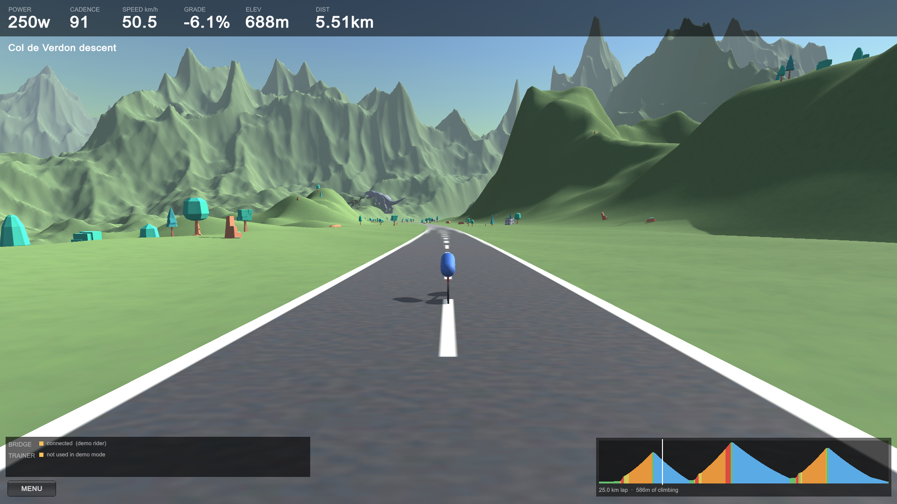
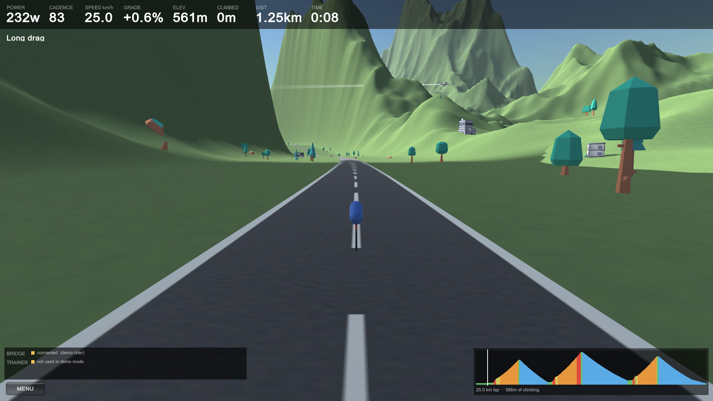
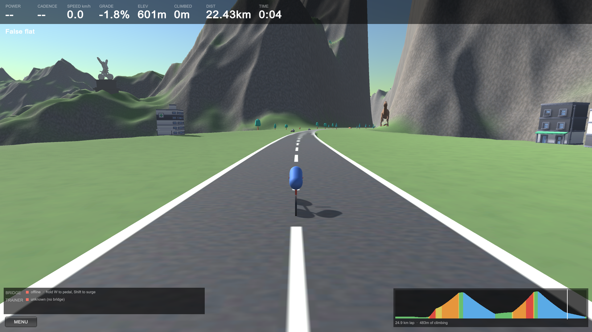
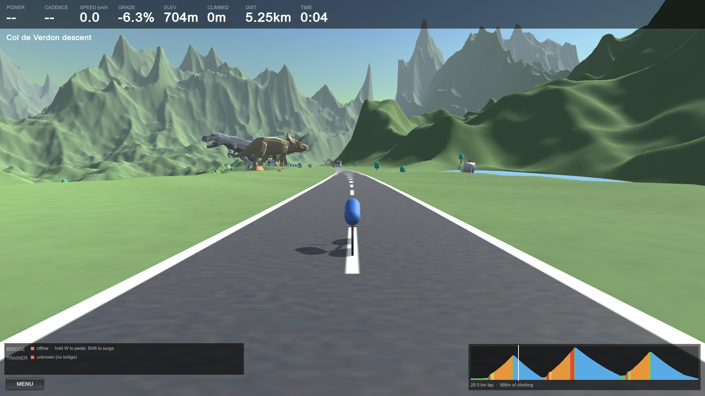

# VibeRide

Ride a Wahoo KICKR through generated 3D terrain.



Your trainer drives it. Power and cadence come in over Bluetooth, a physics model
turns them into speed, and the road gradient goes back out as FTMS simulation
parameters — so the flywheel genuinely gets harder on the climbs.

Every world is generated from a seed: terrain, a 25 km course with real designed
gradients, the road, and the scenery scattered across it. **Regenerate** gives you
a completely different ride in about six seconds, and worlds you like can be
saved by name.

## Now with Airplanes!



Every minute or two an aircraft crosses the sky ahead of you, trailing a
contrail. Never in quite the same place twice.

## And a Monument on the Hill



Every world puts one statue on a hilltop overlooking the course: a rider out of
the saddle with both arms up, the kind of thing real mountains collect. It is
not scattered at random — the terrain is searched for a summit that is properly
prominent, close enough to make out, and genuinely in view from the road.

## And Lakes, with Boats



Lakes are cut into the terrain rather than laid on top of it, so the ground meets
the water at one level all the way round. A small sailing ship and a couple of
rowboats drift about on each.

The road picked up a falling side along the way. The ground used to be flattened
to road level for 120 m either way; now one of those sides drops instead, which is
both what a mountain road actually looks like and the only way to see anything
below you from a bicycle.

## Download

Grab the latest build from the
[Releases page](https://github.com/thepaulm/viberide/releases) — macOS universal
(Apple Silicon + Intel), no Unity required.

Unzip and double-click **Install VibeRide**. It replaces any previous copy in
/Applications, clears the Gatekeeper quarantine flag, re-signs the app so macOS
can attach a Bluetooth permission to it, and opens it. Run it again to upgrade —
there is nothing to delete first.

The first launch takes about a minute while the app builds the Python environment
the trainer bridge needs; the status panel shows the progress. Needs Python 3.9+
(`brew install python3`). After that it starts in a couple of seconds, and it
runs the bridge itself and shuts it down when you quit.

Full instructions are in `START_HERE.md` inside the zip.

No trainer? Launch it anyway and hold **W** to pedal, **Shift** to surge.

## How it fits together

```
   KICKR  --BLE/FTMS-->  bridge (Python)  --WebSocket-->  VibeRide (Unity 6)
          <---grade-----                  <--terrain grade--
```

Bluetooth lives in Python rather than in Unity, which is what lets the same app
run unchanged on Windows and macOS.

## More

**[DETAILS.md](DETAILS.md)** covers the architecture, the course generator and the
constraints that keep it rideable, scenery placement, the in-app menu, building
and packaging for macOS, and a list of hard-won gotchas.

- [`packaging/RELEASING.md`](packaging/RELEASING.md) — cutting a release
- [`unity/Assets/Models/CREDITS.md`](unity/Assets/Models/CREDITS.md) — CC0 model sources
