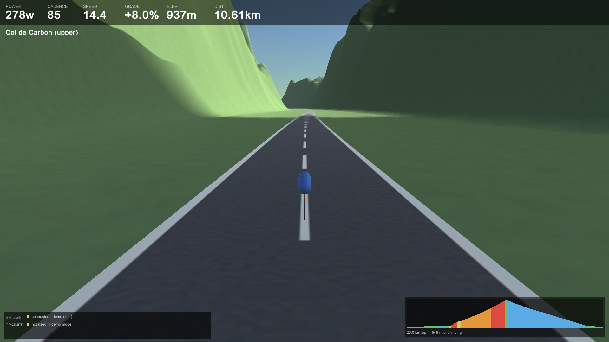

# VibeRide

Ride a Wahoo KICKR through generated 3D terrain.


*Descending at 58.7 km/h on a -6.8% gradient. The elevation profile bottom-right
is coloured by gradient — green flat, amber rising, red brutal, blue descending —
with the white marker showing position on the 25 km lap.*

Your trainer drives it: power and cadence come in over Bluetooth, a physics model
turns them into speed, and the road gradient goes back out to the trainer as FTMS
simulation parameters — so the flywheel gets physically harder on the climbs.



*278 W at +8.0% on Col de Carbon, holding 14.4 km/h. Gradients are designed
rather than emergent, so a climb is a climb every lap.*

The app is **VibeRide**; the repository folder and the internal code namespaces
(`KickrWorld` in C#, `kickr_bridge` in Python) still carry the original working
name. Renaming those is a mechanical but wide change and was left alone
deliberately — nothing user-facing shows them.

## Architecture

Two processes, deliberately:

```
   KICKR  ──BLE/FTMS──▶  bridge (Python)  ──WebSocket JSON──▶  Unity 6
          ◀──grade────                    ◀──terrain grade───
```

The BLE connection lives in Python, **not** in Unity. Unity has no built-in
Bluetooth, and desktop BLE plugins covering both Windows and macOS are scarce,
paid, and fragile. `bleak` speaks WinRT on Windows and CoreBluetooth on macOS
from the same source, so the Mac port is a non-event.

The bridge also owns the physics. Unity's only jobs are to render, to sample the
terrain slope under the bike, and to send that slope back. The loop closes when
the bridge forwards the grade to the trainer as FTMS simulation parameters —
which is what makes the flywheel physically harder on a climb.

### The app launches the bridge

`BridgeLauncher` starts the bridge as a child process at startup, so opening the
app is all you have to do. If a bridge is already listening it defers to that one
instead, which keeps a hand-started debugging session from being fought over.

Shutdown is layered, because an orphaned bridge keeps the trainer's single BLE
connection and blocks the next launch:

| Mechanism | Covers | Measured |
| --- | --- | --- |
| `shutdown` on child stdin | normal quit | 0.01 s |
| stdin EOF | app died without a word | 0.02 s |
| `--parent-pid` watchdog | hard crash / force-quit | 1.66 s |
| `Process.Kill()` | anything still hanging on | last resort |

`bridge/test_shutdown.py` exercises the first three plus the port-conflict path.
An end-to-end check — launch the built player, confirm the child appears, kill
the player outright, confirm nothing is left behind — is the one that actually
proves it.

## Layout

| Path | What it is |
| --- | --- |
| `bridge/kickr_bridge/ftms.py` | FTMS wire format — pure functions over bytes |
| `bridge/kickr_bridge/physics.py` | Power → speed model (gravity, rolling, aero) |
| `bridge/kickr_bridge/trainer.py` | BLE connection + control point serialisation |
| `bridge/kickr_bridge/server.py` | WebSocket server tying it together |
| `bridge/scan.py` | BLE discovery / GATT dump |
| `bridge/selftest.py` | Offline checks — no hardware needed |
| `bridge/testclient.py` | Fake Unity client for exercising the bridge |

## Running

Scan for the trainer (spin the cranks first — it sleeps):

```bash
cd bridge && .venv/Scripts/python.exe scan.py --connect KICKR
```

Start the bridge:

```bash
cd bridge && .venv/Scripts/python.exe -m kickr_bridge.server
```

Work on the 3D side with no trainer present:

```bash
cd bridge && .venv/Scripts/python.exe -m kickr_bridge.server --demo
```

## The world

The course is **route-based, not free-roam**. On a trainer you don't steer, and
pure noise terrain gives you random lumps rather than climbs — 40% walls next to
flat nothing. Instead the elevation profile is designed as a list of segments
with real gradients, the terrain is generated *around* it, and grade comes from
the analytic derivative of the profile. Gradients are therefore exact and
tunable rather than emergent.

Current course — **25.02 km lap, 545 m of climbing, net 0.00 m**:

| Segment | Length | Gradient |
| --- | --- | --- |
| Neutral roll-out | 1.4 km | 0% |
| River road | 1.9 km | 0 → 2% |
| Rolling hills | 2.3 km | ±3% |
| The Wall | 0.7 km | 9 → 12% |
| Recovery shelf | 0.6 km | 3% |
| Col de Carbon | 5.6 km | 6 → 9% |
| Hairpin descent | 4.7 km | −7 → −4% |
| Long valley descent | 5.6 km | −5% |
| Valley run | 1.9 km | flat |

Net elevation is forced to exactly zero so the lap joins seamlessly — you can
ride it indefinitely with no seam and no teleport. Lengths are scaled to the
loop's measured arc length; gradients are preserved, since gradient is what
determines how it feels.

Rebuild the world (regenerates terrain, road and scene from `WorldSettings`):

```bash
"C:\Program Files\Unity\Hub\Editor\6000.2.8f1\Editor\Unity.exe" -batchmode -quit -projectPath "C:\Users\pmike\code\kickr-world\unity" -executeMethod KickrWorld.EditorTools.WorldBuilder.BuildFromCommandLine -logFile -
```

The scene is a build artefact, not a hand-assembled file — change `WorldSettings`
and rebuild rather than editing the scene by hand, or the runtime route and the
baked terrain will disagree and the road will float or sink.

### Memory budget

Terrain settings are chosen for the smallest machine that has to run this, not
the biggest. A 4097 heightmap with a 1024 alphamap and a terrain collider ran
happily on a 65 GB desktop and **crashed an 8 GB MacBook Air on launch** — data
abort in `__bzero`, kernel reporting memory shortage, before a single frame.

Current settings, and why:

| Setting | Value | Reason |
| --- | --- | --- |
| `HeightmapResolution` | 2049 | 4097 is 16.8M samples; 2049 is 4x cheaper at 4.9 m/texel |
| `alphamapResolution` | 512 | a quarter of 1024's memory; splat detail was never the limit |
| `TerrainCollider` | removed | nothing collides with the terrain — see below |

The collider deserves emphasis: the bike's position comes from `RoutePath`
maths, never from raycasting the ground, so PhysX was cooking and holding a
heightfield of every terrain sample for nothing. If you ever add ground-based
raycasting, that removal in `WorldBuilder` is what you need to undo.

**Test on the weakest target.** Everything here passed on Windows with 65 GB of
RAM while being unrunnable on the Mac it was built for.

### Verifying changes

`WorldBuilder` logs numbers, because terrain problems are very hard to judge from
a screenshot. Watch these:

- **`clipped`** — should be 0.00%. Anything above ~1% means summits are being
  sheared into flat mesas by the height ceiling.
- **`gradient check`** — mean error should be ~0.001%. This proves the road
  geometry actually reproduces the designed gradients.
- **`transect`** — terrain height relative to the road at increasing distance.
  If the first 200 m is near-flat you have built a green runway, not a mountain
  road.
- **`splat coverage`** — mean weight per terrain layer, logged both as computed
  and as read back from the asset.

### Screenshots

For a real screenshot, run the built player with `-screenshot`. It uses
`ScreenCapture` on the game's own framebuffer, so nothing on the desktop can leak
in and the result is correct even if the window is occluded:

```bash
VibeRide.exe -screen-width 1920 -screen-height 1080 -screenshot C:\path\shot.png -startdistance 12830 -shotdelay 24 -shotquit
```

`-startdistance` jumps the rider to a point on the course, which beats pedalling
10 km to reach the interesting bit. Start a demo bridge first
(`run_bridge.sh --demo`) and the player will defer to it, so the HUD shows live
numbers instead of "trainer not found".

**`SceneCapture`'s headless stills are not representative.** Batchmode renders
only terrain layer 0, so rock and snow never appear in them regardless of the
alphamap — verified by forcing the splatmap to 100% rock and getting a
pixel-identical green frame. That is a limitation of headless rendering, **not**
of the terrain: a real player renders all four layers correctly, as the
screenshots at the top of this file show. Use headless stills to check geometry
and layout; use a player screenshot to judge how it actually looks.

## Running on macOS

Two pieces have to get there: the player and the bridge.

### The player

Requires the **Mac Build Support (Mono)** module:

```bash
"C:\Program Files\Unity Hub\Unity Hub.exe" -- --headless install-modules --version 6000.2.8f1 --module mac-mono --childModules
```

Then build. The editor must be **closed** — an open editor holds the project lock
and the batch build dies with a bare exit code 1.

```bash
"C:\Program Files\Unity\Hub\Editor\6000.2.8f1\Editor\Unity.exe" -batchmode -quit -projectPath "C:\Users\pmike\code\kickr-world\unity" -executeMethod KickrWorld.EditorTools.PlayerBuilder.BuildAllMacFromCommandLine -logFile -
```

> **One MonoBehaviour per file, named to match the class.** This is a hard Unity
> rule and breaking it is silent: Unity only creates a MonoScript for the class
> whose name matches the `.cs` file, so a second MonoBehaviour sharing that file
> resolves fine in the editor (the type is in memory) but becomes a **missing
> script in every built player**. The player then dies with `level0 is corrupted`
> / `Position out of bounds`, which points nowhere near the real cause.
>
> `WorldBuilder` now fails the build on any missing script reference, and the
> real signal is this line in the Unity build log:
>
> ```
> Script attached to 'Main Camera' in scene '...' is missing or no valid script is attached.
> ```
>
> Use `BuildAll*` rather than `Build*`: it switches the active build target,
> regenerates the world, and builds the player in one session, in that order.
>
> For diagnosing player-only crashes, `VibeRide/Build Smoke Test Player` builds
> a trivial scene as a known-good baseline, and `BisectBuilder` strips the real
> scene down a piece at a time. Note that bisecting mislead here — every variant
> failed because the broken script was on the camera, which none of them removed.

The build is a **universal binary** (x86_64 + arm64), verified by parsing the
Mach-O fat headers — it runs natively on Apple Silicon, no Rosetta. Unity names
that architecture `x64ARM64`; there is no `Universal` value in the enum, and
asking for one silently falls back to an Intel-only player.

Three things to know:

- **Mono, not IL2CPP.** IL2CPP needs the Apple toolchain and cannot be
  cross-compiled from Windows — note there is no `mac-il2cpp` module in the Hub's
  list. Mono is fine here; it only matters if you later want IL2CPP's performance
  or want to ship to the App Store, both of which need building on a Mac.
- **The executable bit does not survive the trip.** Windows has no such
  permission, so a zip made here arrives with the launcher non-executable and the
  app simply will not open. On the Mac, after unzipping:
  ```bash
  chmod +x "VibeRide.app/Contents/MacOS/Kickr World"
  ```
- **Unsigned**, so Gatekeeper refuses it on first launch. Right-click the app and
  choose *Open*, or clear the quarantine flag:
  ```bash
  xattr -dr com.apple.quarantine VibeRide.app
  ```

### The bridge

```bash
cd bridge && ./setup_mac.sh
./run_bridge.sh --demo     # or without --demo for the real trainer
```

`bleak` uses CoreBluetooth on macOS from the same source as WinRT on Windows, so
nothing about the bridge changes. Two macOS-specific things:

- macOS prompts for **Bluetooth permission** for whichever terminal app runs the
  bridge. If you miss the prompt: System Settings → Privacy & Security →
  Bluetooth. The Unity app needs no such permission — it only speaks to
  127.0.0.1, which is a direct payoff from keeping BLE out of Unity.
- macOS identifies BLE devices by **CoreBluetooth UUID, not MAC address**, so
  match the trainer by name (`--match KICKR`, the default). Any address you noted
  on Windows will not be the same string there.

## Gotchas worth remembering

- **One host at a time.** BLE trainers accept a single connection. Zwift, the
  Wahoo phone app, or a head unit will silently hold it and the scan comes up
  empty.
- **Request Control first.** FTMS rejects every command until opcode `0x00` is
  acknowledged. `Trainer.connect()` does this and treats failure as fatal.
- **Flag bit 0 is inverted.** In Indoor Bike Data, instantaneous speed is
  present when the "More Data" bit is *clear*.
- **Cadence is half-RPM.** A raw 180 means 90 rpm.
- **Drain the socket.** The bridge broadcasts at 30 Hz. A consumer that reads
  one message per frame will fall behind into a growing backlog — always drain
  to the newest message and discard the rest.
